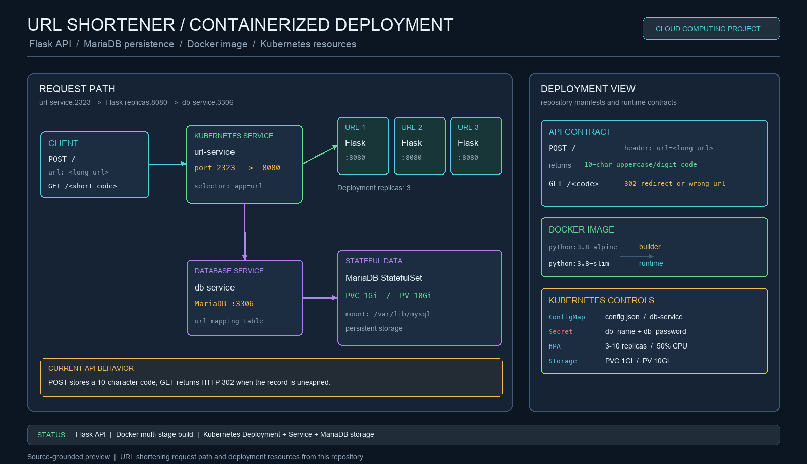
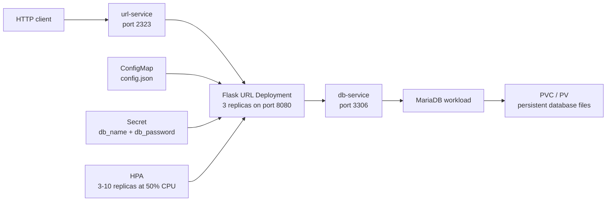

# Containerized URL Shortener with Docker and Kubernetes

> **Recommended repository name:** `containerized-url-shortener`
>
> **About:** Flask URL-shortening service with MariaDB persistence, Docker packaging, and Kubernetes deployment manifests for scaling, configuration, and storage.



## Overview

This project implements a small URL-shortening service with Flask and MySQL-compatible database storage. A client submits a long URL, the service generates a random 10-character code, stores the mapping with an expiration time, and redirects later requests to the original address.

The repository also packages the service as a multi-stage Docker image and includes Docker Compose and Kubernetes resources for running the Flask application with MariaDB. The strongest engineering focus is the boundary between application code and infrastructure: HTTP routing, database persistence, container images, service discovery, configuration injection, replicas, autoscaling, and persistent volumes.

## Features

- Flask API with separate create-short and redirect routes.
- Random uppercase-letter and digit codes generated by `main.py`.
- Database-backed mappings with configurable expiration in minutes.
- HTTP 302 redirects for active short URLs.
- MariaDB-compatible persistence through `mysql-connector-python`.
- Multi-stage Docker build with a Python 3.8 Alpine builder and Python 3.8 slim runtime.
- Docker Compose definition for a web container and MariaDB.
- Kubernetes manifests for Deployments, Services, ConfigMap, Secret, HPA, PV, PVC, and database storage.
- Three URL-service replicas in the Kubernetes Deployment configuration.
- A source-grounded deployment view showing the real request and infrastructure path.

## API contract

The current Flask application expects the long URL in an HTTP header named `url` rather than in a JSON request body.

### Create a short URL

The route is `POST /`:

```bash
curl -X POST \
  -H "url: https://example.com/articles/containerized-services" \
  http://localhost:8080/
```

The application inserts the long URL, generated short code, and expiration timestamp into `url_mapping`. The current source returns a service-style string containing the generated code.

### Follow a short URL

The route is `GET /<short_url>`:

```bash
curl -i http://localhost:8080/ABC123XYZ9
```

If the code exists and its expiration time is in the future, Flask returns an HTTP 302 redirect. Missing or expired entries return `wrong url`.

## Architecture



The Kubernetes service exposes port `2323` and forwards to the Flask container’s port `8080`. The application uses the internal database service name `db-service` in the cluster configuration. The Docker Compose file exposes the web service directly on host port `8080`.

## Run with Docker Compose

Build and start the services:

```bash
docker compose up --build
```

The Compose file maps the web service to `localhost:8080` and MariaDB to port `3306`. The current Compose environment and the Flask configuration are course-project scaffolding; database credentials, database name, host configuration, and initial table creation should be aligned before relying on the stack for repeatable local deployment.

Create a mapping after the database schema is available:

```bash
curl -X POST \
  -H "url: https://www.python.org/" \
  http://localhost:8080/
```

## Deploy to Kubernetes

The `deployment/` directory contains the deployment resources:

```bash
kubectl apply -f deployment/
kubectl get pods
kubectl get services
kubectl get hpa
```

For local testing, forward the URL service port:

```bash
kubectl port-forward service/url-service 2323:2323
```

Then send requests through `localhost:2323`:

```bash
curl -X POST \
  -H "url: https://example.com/" \
  http://localhost:2323/
```

The URL Deployment currently references the published image `farazff/amirsbg_url:1.0`. If you build a new image locally or publish a replacement, update `deployment/url-deployment.yaml` and make the image available to the cluster.

## Configuration

`Local_Config.json` provides the local fallback configuration:

| Key | Purpose | Current value |
| --- | --- | --- |
| `server_port` | Flask listening port | `8080` |
| `expire_time` | Mapping lifetime in minutes | `60` |
| `db_host` | Database host | local Docker address |

In Kubernetes, `deployment/config-map.yaml` mounts a `config.json` file with `db-service` as the database host. Database name and password are injected through `deployment/secret.yaml`.

For a production deployment, credentials should be generated outside source control and supplied through a managed secret system. The checked-in Secret manifest is suitable for demonstrating Kubernetes wiring, not for protecting production credentials.

## Repository map

| Path | Responsibility |
| --- | --- |
| `main.py` | Flask routes, short-code generation, database queries, and application startup |
| `Dockerfile` | Multi-stage Python image build |
| `docker-compose.yaml` | Local web/database service definition |
| `requirements.txt` | Flask, requests, and MySQL connector dependencies |
| `deployment/url-deployment.yaml` | Flask Deployment, replicas, image, ports, and environment |
| `deployment/url-service.yaml` | Cluster service exposing the URL API |
| `deployment/db-service.yaml` | Internal database service |
| `deployment/db-deployment.yaml` | MariaDB Deployment variant |
| `deployment/db-statefullset.yaml` | MariaDB StatefulSet variant with volume claims |
| `deployment/config-map.yaml` | Runtime configuration mounted as `config.json` |
| `deployment/secret.yaml` | Database credential wiring |
| `deployment/hpa-url.yaml` | CPU-based horizontal pod autoscaler |
| `deployment/pv.yaml` / `pvc.yaml` | Persistent database storage |

## Data model

The application expects a table named `url_mapping` with at least the fields used by the SQL statements:

| Field | Meaning |
| --- | --- |
| `long_url` | Original destination URL |
| `short_url` | Generated 10-character code |
| `expire_time` | Timestamp after which the mapping is invalid |

A production schema should add a unique constraint or index on `short_url`, indexes for expiration lookups, and an explicit migration or initialization step.

## Engineering considerations

The repository is a strong cloud-computing exercise, but several details should be tightened before production use:

- Check for short-code collisions before committing a new mapping.
- Use a configured public base URL in the create response instead of returning an internal service address.
- Read database name and password consistently from environment variables for both routes.
- Replace Flask’s development server and `debug=True` with a production WSGI server.
- Add database initialization and migrations instead of assuming `url_mapping` already exists.
- Use one MariaDB workload definition. The repository includes both a Deployment and a StatefulSet variant, so the selected database resource and Service selector should be made consistent.
- Remove generated Kubernetes fields such as resource versions, UIDs, timestamps, and status blocks before reusing manifests.
- Add readiness/liveness probes, resource limits for every workload, and a managed storage class.
- Validate and sanitize URL input, define error status codes, and return JSON responses for API clients.
- Add tests for expiration, redirect behavior, database failures, duplicate codes, and malformed requests.

## Verification

The current Python source passes syntax compilation with:

```bash
python3 -m py_compile main.py
```

The Docker Compose file and Kubernetes YAML resources were also parsed successfully with PyYAML. A full service test requires a running MariaDB instance with the expected `url_mapping` schema.
